## PROJECT4_ROSHAN - The Soul of India

## Introduction-Purpose of the Project
This project is based on a popular western India Maharashtrian hotel named Mai's Kitchen which traditionally serves authenticic and mouth watering cusine. The name **MAI** means **mother** in ***Marathi*** language.
The client can reserve a table online at a date and time of their choice and based on circumstances can change or delete the reservations.
The website is responsive, based on agile methodology and uses frontend development tools and technologies to provide a good UI/UX experience. 

## Project Summary

- This is a Django-based restaurant reservation system for an "Authentic Maharashtrian Restaurant".
- It follows Django's MVT (Model-View-Template) architecture:

- It allows users to
  - View homepage content and reviews.
  - Create,Read,Update,Delete (CRUD) reservations (with login).
  - Submit feedback. ( with and without login)
  - View contact info. ( embedded google map , email,contact number and timing)
- It includes:
  - HTML templates for various pages.
  - Django models for Reservation and Feedback.
  - Forms to submit reservations and feedback.
  - Views for form handling, CRUD operations, and displaying data.

- Templates (HTML)
  - base.html: Master layout (header, footer)
  - index.html: Homepage
  - reservation_form.html: reservation form
  - reservation_list.html: Display reservations made by the user
  - update_reservation.html: Edit form that helps logged in user update their own reservation
  - confirm_delete.html: Delete a users own reservations after login
  - about.html: Feedback form
  - contact.html: Contact and map

- Models 
  - Reservation: Stores booking info, ensures rules (no past date, max 10 guests)
  - Feedback: Stores messages tied to reservation or user

- Views
  - PostList: Shows homepage
  - about_me: Saves or shows feedback
  - contact_us: Displays contact info
  - reservation_form: Save reservations after validation
  - update_reservation: Let user edit their own reservations
  - delete_reservation: Confirm and delete a users own reservations
  - reservation_list: Display user’s rservations only

- URLs 
  - /       → Home (PostList)
  - /about/ → Feedback (about_me)
  - /contact/       → Contact info
  - /reservation/form/ → Reservation form
  - /reservation/list/ → View Reservations
  - /reservation/update/ID → Edit reservations
  - /reservation/confirm_delete/ID → Delete reservations

- Forms 
  - ReservationForm: Collects name, email, time, date, guests
  - FeedbackForm: Collects guest/user opinion

### Logic Explained 

- Each step below shows what the user sees or can do:
  - Homepage: This is where users start. It shows information about the restaurant.
  - Login / Signup: Required before making any reservations.
  - Make a Reservation: Form is displayed only after login. Requires date, time, guests.
  - View My Reservations: Displays all bookings created by the current user.
  - Edit Reservation: Allows the user to change date/time of their booking.
  - Delete Reservation: Lets the user cancel their booking after confirmation.
  - Feedback: Open to all. Logged-in users link it to their booking.
  - Contact Page: Public page showing contact information and map.

## Website Structure and feature description 

### HTML File Breakdown

- File : index.html - the Homepage 
- Purpose : 
  - Shows a big welcome message (jumbotron)
  - Has a "Reservations" button that displays a popup modal for login/signup
  - Shows Update/Delete Reservation buttons
  - Displays Customer reviews and Restaurant highlights
- Who can view this?
  - Everyone. No login needed.

- File :about.html
- Purpose :Feedback form + list of recent feedback entries.
- Who can view this?
  - Everyone. No login needed.
- File : contact.html
- Purpose : Static contact info with embedded Google map.
- Who can view this?
  - Everyone. No login needed.
- File :reservation_form.html	
- Form to make a new reservation.
- Who can view this?
  - Everyone. No login needed.
- File :reservation_list.html	
- Displays all reservations made by the logged-in user.
- Who can view this?
  - Everyone. No login needed.
- File :update_reservation.html	
- Lists reservations with update/delete actions.
- Who can view this?
  - Everyone. No login needed.
- File :confirm_delete.html	
- Confirms cancellation before deleting a reservation.

## Features

- The project code is written in fron end development tools- HtML, CSS, Bootstrap,Django framework inside the code institute IDE.   
- Github is used to host the repository.  
- Heroku the dynamic websites platform is used to host backend language python.  
- PEP8 style guide was referenced to style the code
- The website offers simplicity and consistency within its structure.  Its structure was designed to be responsive on screens from 320px up to 2560px.
- The website is designed using the **"Mobile First"** Responsive approach using a structured layout and "meta" tags.
- The website has three pages including the landing page.  **"Home", "Register", "Login"**.
- The header includes the title of the website **" Taj Mahal- An Eternal Calling** and is common across all pages     
- The footer includes the **"copyright"** and **"social media icons"** and **link to download the menu**.  
- The chocie of foreground and background colors have the right contrast providing a rich user experience .  
- External links open in a seperate tab **social media"** and **link to download the menu** in the footer. 
- CSS media queries are used where appropriate for different screen sizes.  
- Relative paths are used for refering to folders and files.  
- **"Hover"** property used to hightlight pages on navigation bar, and social media icons in the footer.
- Bootstrap framework based on version 4.6.x https://getbootstrap.com/docs/4.6/getting-started/introduction/ is used extenstively. 
- Aria accessibility for screen readers.   

## Font family and colors.
- Google fonts used for styling. Download link:
  "https://fonts.googleapis.com/css2?family=Roboto:ital,wght@0,100;0,300;0,400;0,500;0,700;0,900;1,100;1,300;1,400;1,500;1,700;1,900&display=swap"
- Font-family used for styling : **Roboto**, **sans-serif**
- Colors used for styling:  #042a49, white, black,  brown, blue, #f05f40, #042a49
        
## Technology used in development and testing.

- **Google Chrome** as the Browser.
- Cloud-based platform **gitpod.io** and **github** used for designing and hosting the website.
- Bootstrap Framework v4.6.x- https://getbootstrap.com/docs/4.6/getting-started/introduction/
- Heroku - Heroku is a cloud platform that lets companies build, deliver, monitor and scale apps — we're the fastest way to go from idea to URL, bypassing all those infrastructure headaches. https://dashboard.heroku.com/apps/roshanproject4
- Devices with different viewports for testing the responsiveness - **Galaxy A54, iPhone 14 Pro, Galaxy A25, Asus AMD Ryzen7 4800H with 
  Radeon Graphics**.
- Django Framework based on Python 3.12.2.
- Linters - https://pep8ci.herokuapp.com/# 

### Libraries & Frameworks

- Django Framework based on Python 3.12.2.(https://www.djangoproject.com/) - Free and open source Python Web Framework
- Gunicorn (https://gunicorn.org/) - A Python WSGI HTTP server compatible with Django and used to run the project on Heroku
- PostgreSQL 0.5.x (https://www.postgresql.org/) - A powerful, open-source object-relational database system
- Pyscopg2 2.9.5 (https://www.psycopg.org/docs/) - A PostgreSQL database adapter for Python
- Heroku (https://www.heroku.com) - A cloud platform as a service
- Django Allauth (https://django-allauth.readthedocs.io/en/latest/) - Integrated set of Django applications addressing authentication and registration
- Bootstrap 4.6.2 (https://getbootstrap.com/docs/4.6/getting-started/introduction/) - A Framework for building responsive, mobile-fist sites
- whitenoise==5.3.0 (https://whitenoise.readthedocs.io/en/latest/) - WhiteNoise is used for serving static files in a Django application.
- sqlparse==0.5.0(https://pypi.org/project/sqlparse/) - SQLParse is a library used for parsing SQL queries in Python.

## staticfiles 

All static files were consolidated and brough a sibgle folder to allow to be accessed by the Heroku App

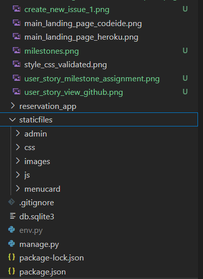

## Website Structure and feature description 
- The Django Design Philosopies are widely implmented to acheive the fundamental goals of **Loose Coupling, Less Code, Quick Development and Don't Repeat yourself (DRY), Explicit is better than Implicit and Consistency**.https://docs.djangoproject.com/en/4.2/misc/design-philosophies/
- The Structure is defined accordingly. The **Base.HTML** includes the **Head, Navbar** and **Footer** Sections.
- The **Home page** or **Index.HTML** includes the content - **Callout, Customer Reviews and Highlights**.
- The **login page** allows the guest to **login** to the **SQLite database** to reserve a table and **change** or **cancel** a reservation
- The **Register** page allows the guest to **sign up** at the restaurant website.
- Bootstrap framework based on version 4.6.x https://getbootstrap.com/docs/4.6/getting-started/introduction/ is used extenstively. 

## Website pages and feature description

### BASE.HTML 

### Head Section 
- The head section is based in the BASE.HTML file based on Django Design philosophies loose coupling philosophy
- The head section has the title **Soul of India**.
- The links to **google fonts, fontawesome, bootstrap, hover.css**, are all defined here.
- The styles.css file is also linked here.
- Viewport tag to respond to different resolutions, particularly mobile ones.

### Navbar Section
- Based on Django design philosophies, the "Navbar" section configued in Base.HTML includes the following.
- The Brand **MAI'S KITCHEN**.
- The **unordered list** for the header links inlcuding configuration to collapse into a **three bar icon** on small screens.
- The text**The way to your soul is through the stomach** prominently displayed on the right hand side of the header.

### Footer 
- The Footer displays "social media links" which open in a separate tab for ease of use.
- The Copy right section with the author's name is also prominently displayed on the left had section.
- The central part of the footer is reserved for guests to download the Menu. This menu is a PDF file and opens in a new tab so that the user does not have to navigate back to the page he was on.
- The PDF file is stored under the **project4_reservation** app section under the **static/css/menucard folder**.
- The Menu includes our restaurant address. 
- All social media links are "hover enabled" and open in seperate tabs.
- The following social media links have been configured- **Facebook, Twitter, Linkedin, Instagram, and Youtube**. 
- **A note of caution here** - MAI's Kitchen website does have a presence on any of the social media links, these links have only been configured to demonstrate front end design capability for this project.  

### INDEX.HTML 

 ### Callout Section 
 #### Screenshot of main landing page
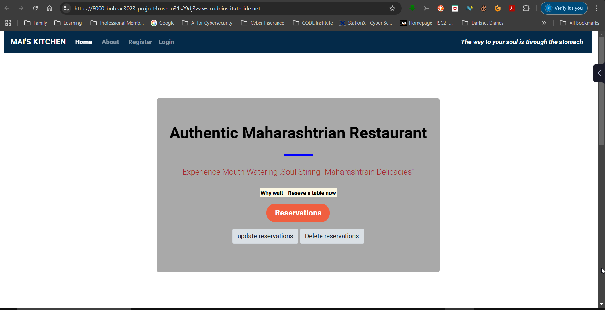
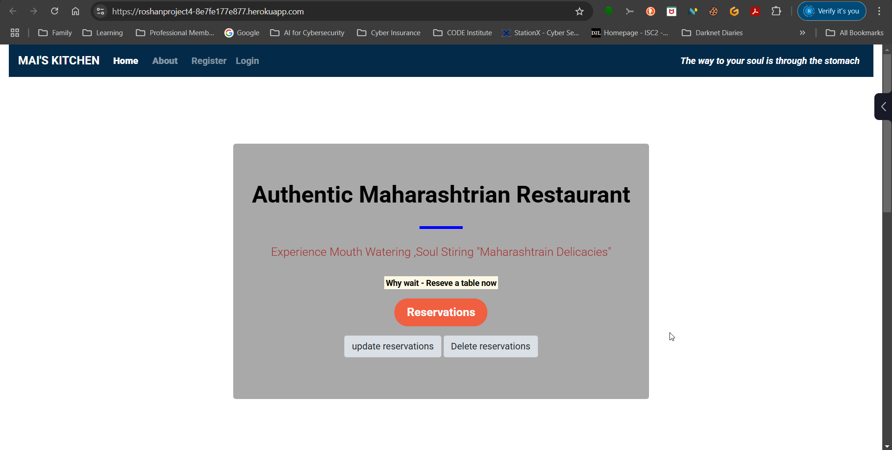

- The **Callout section** includes a **Callout Jumbotron**.
- This jumbotron prominently displays the header **Authentic Maharashtrian Restaurant**
- **Jumbotron** also includes Bootstrap defined ARIA enabled butons for guests to make **reservations**, **update reservations** and **cancel reservations**.
- The **reservations button** is linked to a **form** configured in the **Modal section** 
- The update and cancel reservations button direct to the respective forms configured on **update_reservation.html** and **confirm_delete.html**

### Customer Reviews Section.

- As MAI's Kitchen is a new restaurant it is importnat that we highlight our acheivements and menu items.
- This section has reviews from a prominet food blogegr and a Bollyhood actor
- A future feature is to inlcude a section for guests to leave us with their reviews direcly through our website. 
  
### Highlighhts Section. 
- This section is used to highlight to MAI KITCHEN's patron on the uniqueness of the restaurant. 
- This is broken down into **Three Themes**
- ***Nourish the Soul*** - Mai’s Kitchen takes pride in serving traditional Maharashtrian cuisine, hailing from the western state of Maharashtra in India. 
- ***Made with Love*** -All our meals are made with love. We ensure ,flavours of the past continue to shape our future.
- ***Authentic and Vibrant*** - We aim to bring in seasonal menus, chef’s favourites, and special offers. 

## Wireframes

Wireframes were first sketched with pen and drawn using Microsoft Powerpoint 

Two custom models have been implemented in this project.

## Schema used for this Project

### Models 
Three Models were created but only One Used. The models names as below 

- Reservation model - linked to reservation_app
- Feedback model - linked to reservation_app
- Review Model  - linked to about_app 

The reservation_app model had the following fields created 

- name
- email
- message
- date
- time
- guest
- read
- created-on
- status  ( This was initially set to 0-created and the rservation manager could then change this to approved)

### Class

- ReservationAdmin
- ReservationForm 

___

## User Stories and Methodology

GitHub Issues was used to plan and implement the user stories and test acceptance criteria
Link to github issues  :  

Each User Story contains **Acceptance Criteria -AC** to meet the  **Minimum Viable Product(MVP)** criterai for this project.
The user story acceptance criteria was based on ***As a, I can, So that*** or ***I Know I am done when***

The **MoSCoW Method of Prioritisation**(https://www.agilebusiness.org/dsdm-project-framework/moscow-prioririsation.html) was also refered to for the user story concepts based on **Must Have**, **Should Have** ,**Could Have** ,**Won’t Have**.

### Github Issues User story screenshot 

-Create new issue
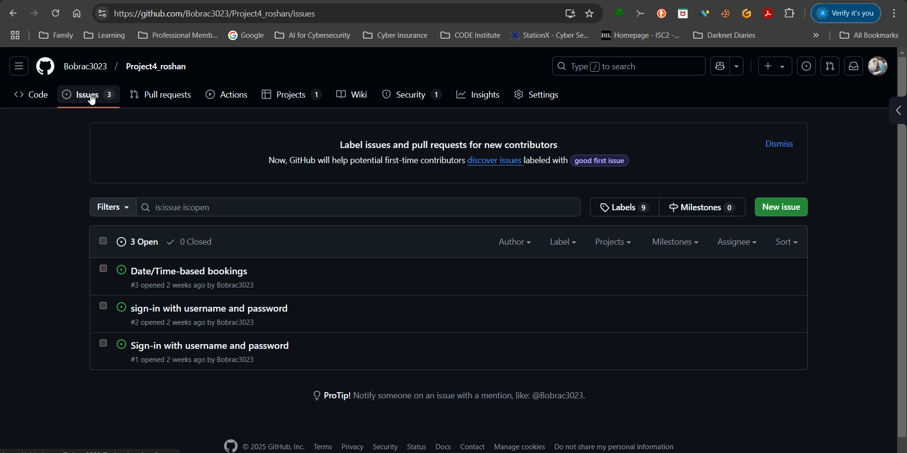
-View of user stories on github issue
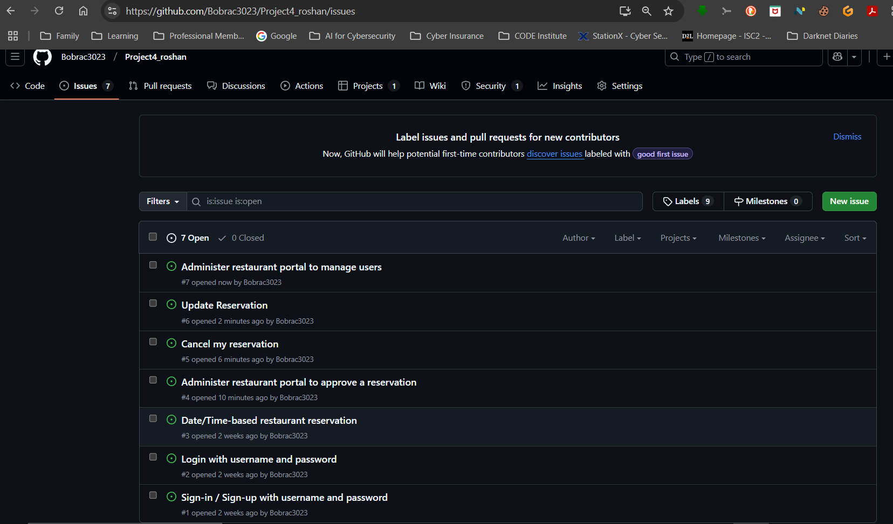
-View of Milestones for the project
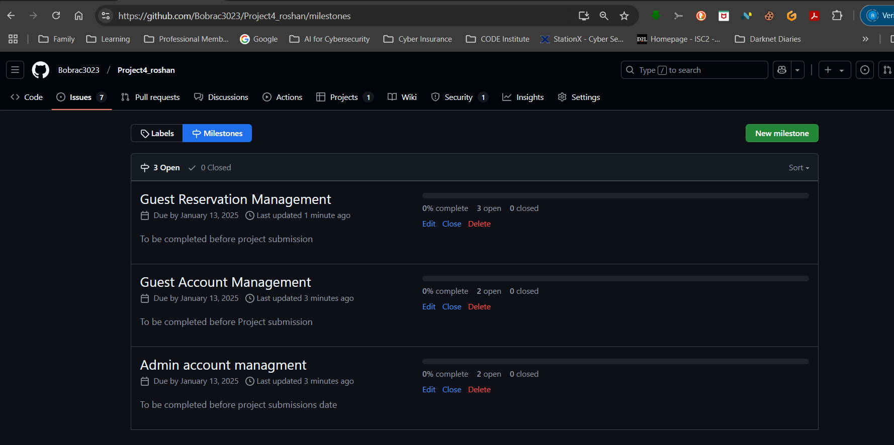 
- View of user stories to milestones 
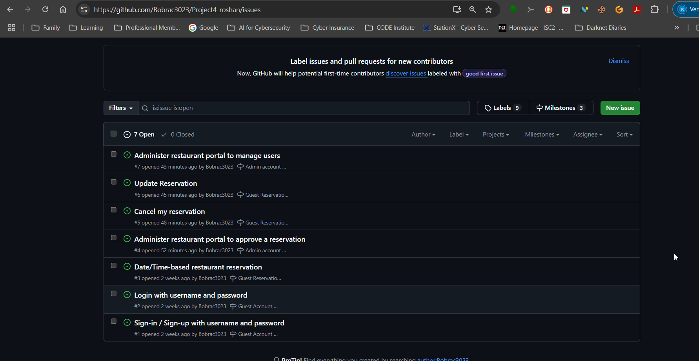

## Admin/Business Owner User Story and Acceptance Criteria 

No automated testing was done . All manual testing was done and screenshots attached 

The Admin Account Managment Milestone was created with two user stories and both were tracked in Github issues 
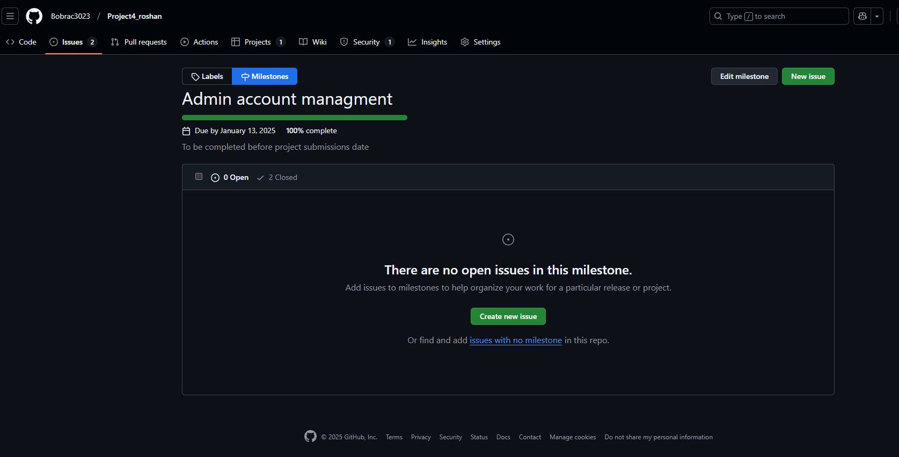
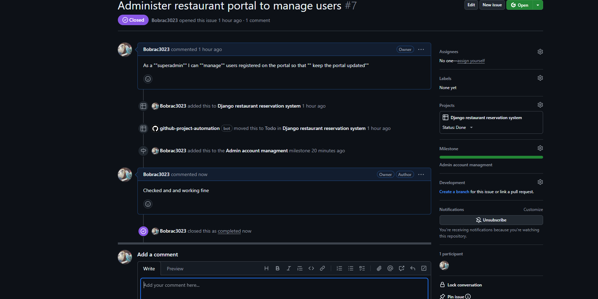

### As an admin, I want to create, update, and delete reservations so that I can assist users with their bookings. 
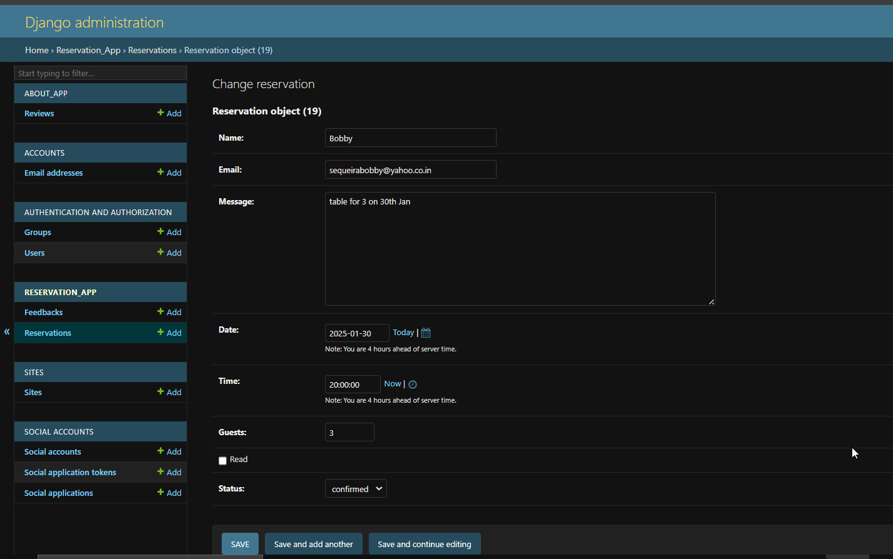

### As an admin, I want to view a list of all reservations so that I can manage booking schedules.###
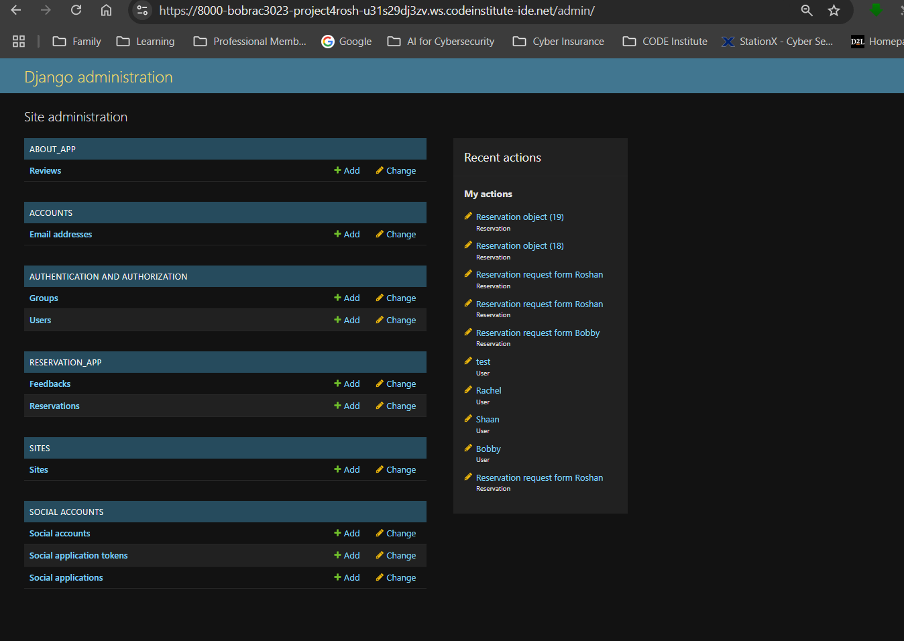

## Guest Account Managment 

No automated testing was done . All manual testing was done and screenshots attached 

The Guest Account  Managment Milestone was created with two user stories and both were tracked in Github issues 
As a guest I should be able to sign-up to the restaurant portal with a unique username and password. 
As an guest, I should be able to login in to the restaurant portal based on my previous sign-up
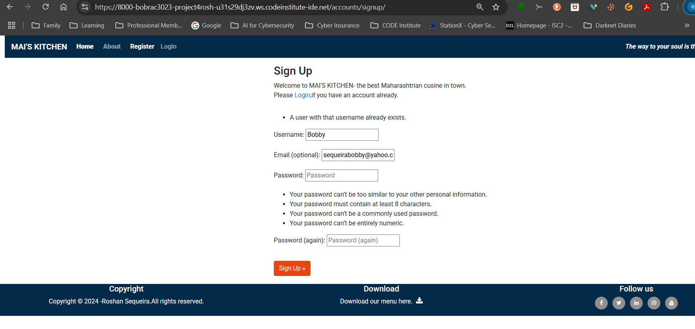
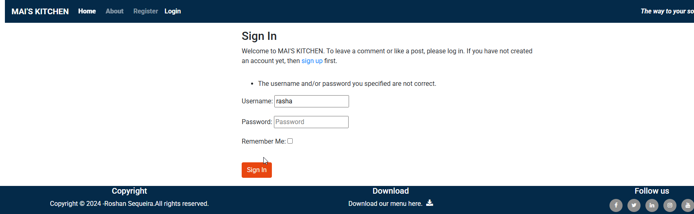

## Guest Reservation Managment  

No automated testing was done . All manual testing was done and screenshots attached 

The Guest Reservation Managment Milestone was created with three user stories and tracked in Github issues 

### As a guest I should be able to login in and create a reservation. 

As a guest, I should be able to login in to update my reservation.
As a guest, I should be able to login in to cancel my reservation.

## Links to Github, Gitpod and Heroku

- External Link  
  
- Github issues : https://github.com/users/Bobrac3023/projects/2/views/1

- Heroku app :  https://roshanproject4-8e7fe177e877.herokuapp.com/
  
- Link to Github repository : https://bobrac3023-project4rosh-u31s29dj3zv.ws.codeinstitute-ide.net/

- Link to Gitpod workspace.  
  

## Features to implement later

- Use API to implement a google map with markers
- Implement an external email system like sendemail to receive guest feedback. This will be integrated using API.
- Menu Page - A page to display dish of the wekk and "what's special".  
* Forgot/Reset password functionality

## Deployment

### Deployment from GitHub
-The site was deployed to GitHub pages as below.  
-In the GitHub repository,
-   Navigate to the Settings tab,
-   Select pages
-   Under **Branch** dropdown, change to **Main** hub from **none**.

-select_branch_github_deployment

-From the **Actions** tab, select **Deployment** to check deployment status and capture external link.

## Testing and code validation

-Code and functions were tested and validated using the three tools listed below:-  

- gitpod IDE environment    https://bobrac3023-project4rosh-u31s29dj3zv.ws.codeinstitute-ide.net/
- Python Linter - https://pep8ci.herokuapp.com/# 

### Test,validate HTML Files

No automated testing was done . All manual testing was done and screenshots attached 

### Test and Validate CSS file ###
- Link https://jigsaw.w3.org/css-validator/validator

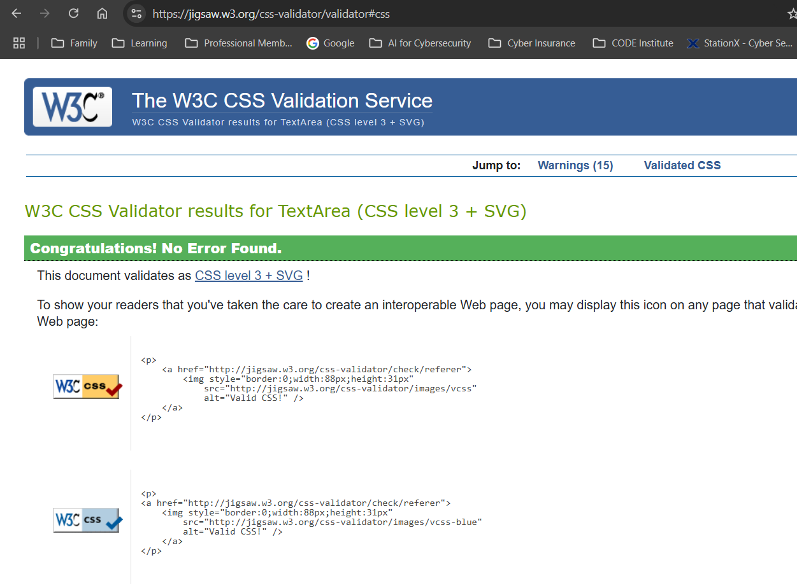

### Code insititute IDE output ###

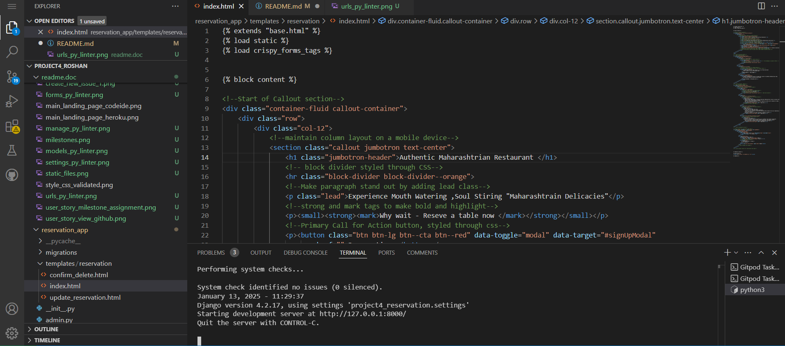

### Python File validation ###

-Settings.py A note of caution here to the reader of this file. In the code-institue linter the lines which are flagged of as too long, when corrected produce an error when we run python3 manage.py runserver 

Screenshot show the out put of the linter after the changes were carried out. A few need to be changed in the ide setup. 

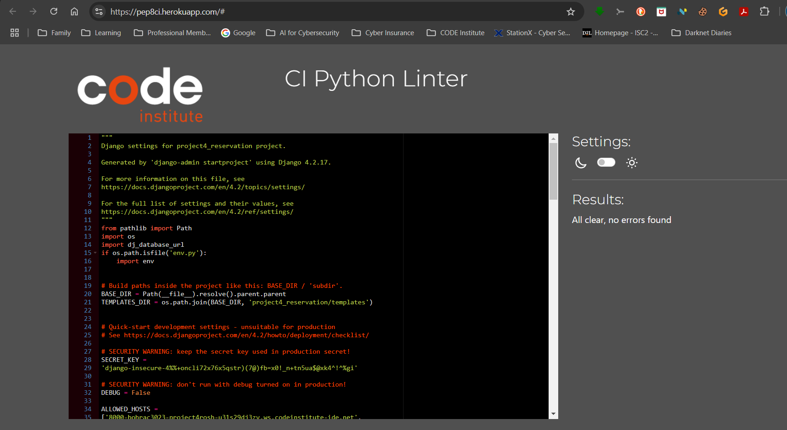

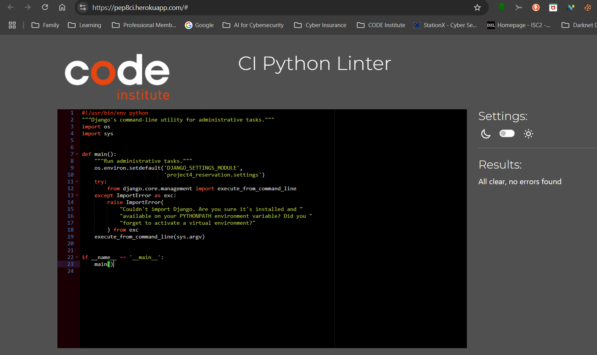
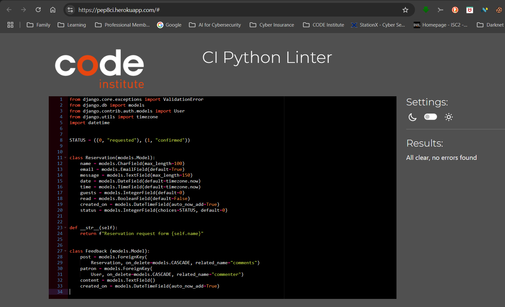
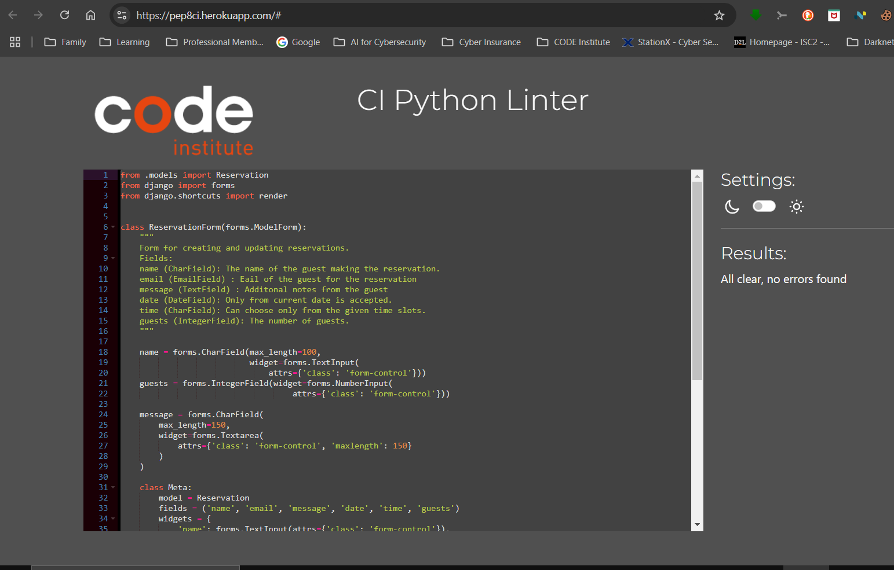
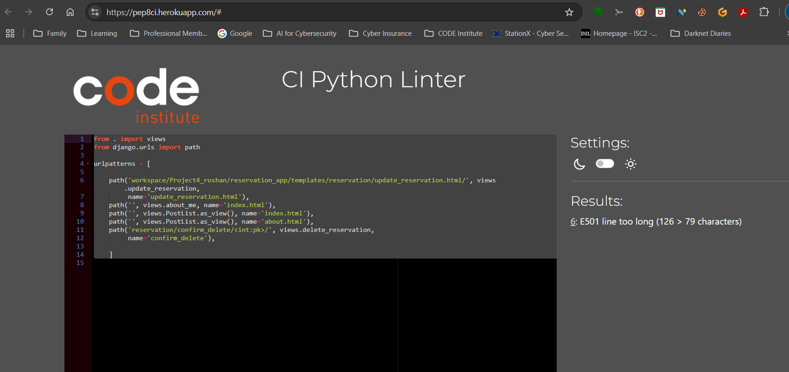

